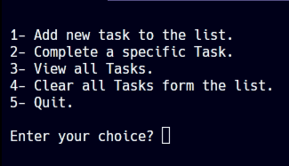

# Task Manager

Task Manager is a simple command-line application for managing tasks. You can add, complete, view, and clear tasks in this task manager. Tasks are persisted using a `tasks.json` file, so they remain present even when you close the program.

## Features

- Add new tasks to the list.
- Mark tasks as completed.
- View the list of tasks.
- Clear all tasks.

## Usage

1. **Clone the Repository**
```bash
git clone https://github.com/justzeiad/task-manager.git
cd task-manager
```
2. **Run the Program**

```bash
python main.py
```

3. **Use the Menu**

- Enter `1` to add a new task.
- Enter `2` to mark a task as completed.
- Enter `3` to view all tasks.
- Enter `4` to clear all tasks.
- Enter `5` to exit the porgram.

4. **Persistence**

Tasks are automatically saved to a `tasks.json` file when you add or complete them. This means your tasks will be present even when you close the program and reopen it.

## Screenshot



## Contributing

If you would like to contribute to this project, please open an issue or create a pull request on GitHub.

## License

This project is licensed under the MIT License. See the [LICENSE](LICENSE) file for details.
